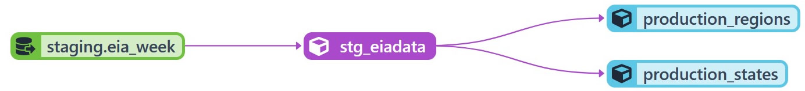
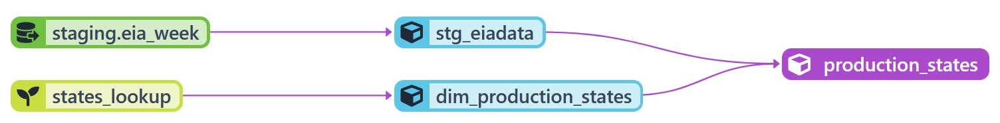
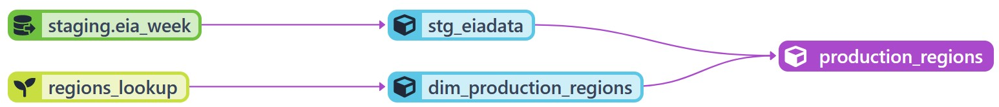
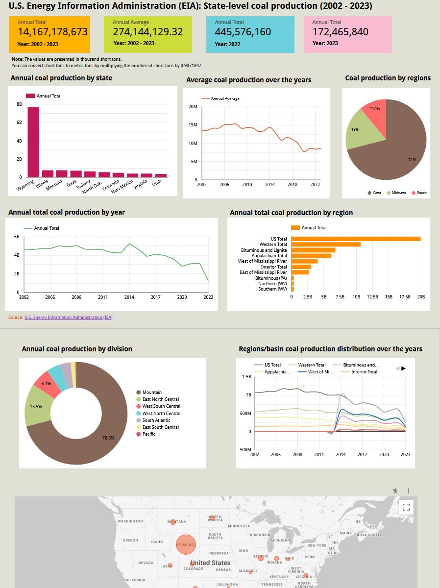

# Data Engineering Zoomcamp Final Project

## Overview
This data pipeline project uses the [U.S. Energy Information Administration (EIA)'s](https://www.eia.gov/) weekly original estimates of state level coal production to generate coal production analytics acquired from the Mine Safety and Health Administration (MSHA). The pipeline focuses on using the weekly coal production datasets, which are publicly available in XLS format on the EIA website. The datasets are part of the weekly and monthly Coal Production dataset, which contains information on world energy statistics and is comprised of 22 CSV files.

This data pipeline transforms raw data into data ready for analytics with the intention of keeping data flowing to provide insights that lead to informed decisions. The goal of this project is to apply everything learned in the Data Engineering Zoomcamp course and build an end-to-end data pipeline.

## Datasets
The dataset has 54 columns - of which 53 are values for each week of year represented as "week 01", "week 02" etc . The following columns are used for the weekly data:

| #  | Attribute             |                     Description                                      |
|:--:|:---------------------:|----------------------------------------------------------------------|
|  1 | **state**                | A US state that produces coal.                  |
|  2 | **week 01 - week 53**          | Amount of coal produced in the week of a particular year (in thousand short tons)|
|  3 | **Total**          | Amount of coal produced in the particular year (in thousand short tons)|  


The following columns are used for the monthly data:

| #  | Attribute             |                     Description                                      |
|:--:|:---------------------:|----------------------------------------------------------------------|
|  1 | **state**                | A US state that produces coal.                  |
|  2 | **Jan - Dec**          | Amount of coal produced in the month of a particular year (in thousand short tons)| 
|  3 | **Total**          | The total amount of coal produced in the particular year (in thousand short tons)| 

Dataset Url: https://www.eia.gov/coal/production/weekly/includes/archive.php


## Problem statement
The goals of this pipeline is to:
* Extract coal production data from the Mine Safety and Health Administration website
* Transform the data to generate derived quantities for further analysis.</li>
* Load the transformed data in Big Query.</li>
* Orchestrate the pipeline using an orchestration tool.</li>
* Generate an online dashboard summarizing some of the findings.</li>

This project has the goal of answering the following questions among others:

1. What is the total estimated U.S. coal production in million short tons (MMst)
1. What is the average monthly or yearly tonange of coal produced in US since 2002?
2. Which is the highest coal producing state and region?

## Technologies used
* Google Cloud Platform (GCP): Cloud-based auto-scaling platform by Google
* Google Cloud Storage (GCS): Data Lake
* BigQuery: Data Warehouse
* Terraform: Infrastructure-as-Code (IaC)
* SQL: Data Analysis & Exploration
* Prefect (Cloud): Pipeline Orchestration
* DBT (Cloud): Data Transformation
* Docker: Containerization
* Spark: Distributed Processing 
* Pandas: Data Analysis & Exploration

## Data Pipeline Architecture
* The pipeline created for this project was for batch processing which runs periodically on a daily basis (for current year data) and once for historical data. The image below represents the architecture employed in this pipeline.


### Prerequisites
Ensure that the following python modules are installed in your environment
```
pip install pandas (required for data manipulation and analysis)
pip install pandas-gbq (required to load data from Google BigQuery)
pip install numpy (required for working with arrays)
pip install prefect (required for orchestration)
pip install prefect_gcp (required for read data from and write to BigQuery within Prefect flows)
pip install pyarrow (optional: required for handling columnar and/or chunked data in memory)
pip install xlrd (required for extracting data from Excel spreadsheets)
pip install pyspark (required to process larger datasets in a distributed cluster)
``` 

### How the data pipeline works

* **Prefect Flows**

    Flows are like functions, they can take inputs, perform work, and return an output. Any function can be turned into a Prefect flow by adding the @flow decorator. Flows take advantage of automatic Prefect logging to capture details about flow runs such as run time, task tags, and final state. We have three flows in this pipeline as follows:

    1. [ETL: Web to GCS](./prefect/etl_web_to_gcs.py): fetches xls files from the EIA website, extracts and transforms the data, and finally loads them into GCS bucket as Parquet files. It renames the weekly files column names from the format: *'04/01/2023  (week 13)'* to the format: *'week_1'*. For the monthly files it renames the  column names from the format: *'Jan 2023'* to the format: *'Jan'*. For the xls files before 2014 had a different naming convention of the column names hence the need to rename them accordingly to one standard naming. Other cleaning is done such as removing unused characters and droping empty rows. The ETL process will execute once to obtain coal production data from the past (2001 up to the current year). Thereafter, it will retrieve weekly data solely for the current year.

    2. [ETL: Spark](./prefect/etl_spark.py): This ETL runs a Spark Job that fetches the raw Parquet files from GCS, tranforms them by adding a schema then saves them back on GCS. The schema ensures data integrity, consistency, and efficient data processing. Two jobs are scheduled on Cloud DbT, one runs once every week and the other runs once every month.

    3. [ETL: GCS to BigQuery](./prefect/etl_gcs_to_bq.py): fetches data from GCS, transforms the data by adding *'year'*, *'annual_average'*, *'annual_total'*, and *'modified'* columns, then loads the data into BigQuery on the tables *'eia_week'* and *'eia_month'*. The *'modified'* column allows us to know when data was appended to the table. The ETL process will execute once to obtain coal production data from the past (2002 up to the previous year). Thereafter, it will retrieve monthly data solely for the current year.

* **Prefect Deployments**

    Prefect deployments allow the flows to be scheduled and triggered via API. A deployment stores metadata about where the flow's code is stored and how the flow should be run. Creating a deployment for a Prefect workflow means packaging workflow code, settings, and infrastructure configuration so that the workflow can be managed via the Prefect API and run remotely by a Prefect agent. This pipeline has three deployments as follows:

    1. [Deployment: GCS Flow](./prefect/docker_deploy_to_gcs.py): script deploys the prefect flow *'prefect/etl_web_to_gcs.py'* to Prefect Cloud. This deployment is scheduled to run once a week.

    2. [Deployment: Spark Flow](./prefect/docker_deploy_spark.py): script deploys the prefect flow *'prefect/etl_spark.py'* to Prefect Cloud. This deployment is scheduled to run once a week immediately after the GCS Flow has run.

    3. [Deployment: BigQuery Flow](./prefect/docker_deploy_to_bq.py): script deploys the prefect flow *'prefect/etl_gcs_to_bq.py'* to Prefect Cloud. This deployment is scheduled to run once a week immediately after the Spark Flow has run.

    Before making the deployment scripts create a Docker Block on Prefect Cloud then use the code generated (as below) to create the deployments. 
    ```
    from prefect.infrastructure.container import DockerContainer
    docker_block = DockerContainer.load("<your-docker-block-name>")
    ```
    The above deployments are created and run or tested using the commands like the ones below:
    ```
    #create the deployment
    python prefect/docker_deploy_to_gcs.py

    #test/run the deployment
    prefect deployment run prefect/docker_deploy_to_gcs.py
    ```
    
    Build and push the pipeline (image) to Docker Hub using commands below. All the pipeline's files will be pushed and will run from Docker Hub.
    ```
    docker image build -t <docker hub username>/prefect:zoom .
    docker image push <docker hub username>/prefect:zoom

    ```

* **Dbt Models and Seeds**

    Dbt enables us to transform, test, and document the data in the cloud data warehouse. For this pipeline dbt Cloud is used as it is the fastest and most reliable way to deploy dbt. This pipeline uses dbt to transform the raw data to new data summaries and it is also used for data quality checks. The following figure illustrates how dbt works.
    
    
    
    Using dbt we are able to form four (4) new tables/views on BigQuery named follows: *'stg_eiadata'*, *'production_states'*, *'production_regions'*, and *'states_lookup'*. The models and seeds developed are located under the *'models/staging'*, *'models/core'* and the *'models/seeds'* folders. Three dbt models and two seeds have been developed to accomplish this task as follows:

    1. [stg_eiadata](./dbt/staging/stg_eiadata.sql): selects a all columns from the  staging table (stg_eiadata) that was loaded into BigQuery, and adds a unique key field. 
        ```
        {{ config(materialized="view") }}
        select
            {{ dbt_utils.surrogate_key(["state", "year"]) }} as eia_id,
            state,
            year,
            
                cast(week_{{ week }} as integer) as week_{{ week }}
                ,
            ,
            annual_average,
            annual_total,
            {{ categorize_state("state") }} as state_category,
            modified
        from {{ source("staging", "eia_week") }}
        ```
        

    2. [production_states](./dbt/core/production_states.sql): selects all state data from the view *'stg_eiadata'*, partitions it by year and forms a new denormalized view *'production_states'*. The partitioning makes it more efficient to query data and extract statistics by *'year'*. With respect to clustering, *'state'* is the main categorical value but for this project we did not cluster the table as it adds no permormance benefit. This model is located under the *'models/core'* folder. The model employs a macro named [*'categorize_state'*](./dbt/macros/categorize_state.sql) to distinguish the states from the regions.

        ```
            {{
                config(
                    materialized="view", partition_by={"field": "year", "data_type": "integer"}
                )
            }}

            with
                production_data as (
                    select state, year, annual_average, annual_total, state_category
                    from {{ ref("stg_eiadata") }}
                ),

                dim_production_states as (select * from {{ ref("dim_production_states") }})
            select
                state_name.state,
                state_code,
                year,
                region,
                division,
                basin,
                east_west_mississippi_river,
                annual_average,
                annual_total
            from production_data
            inner join
                dim_production_states as state_name on production_data.state = state_name.state
            where coal_state = 1 and state_category = 'State'
        ```
        
	
	3. [production_regions](./dbt/core/production_regions.sql): selects all regional data from *'stg_eiadata'* and partitions the table by year . The tables is not clustered. This model is located in the *'models/core'* folder in the dbt folder.  The model employs a macro named [*'categorize_state'*](./dbt/macros/categorize_state.sql) as above.

        ```
            {{
                config(
                    materialized="view", partition_by={"field": "year", "data_type": "integer"}
                )
            }}

            with
                production_data as (
                    select state, year, annual_average, annual_total, state_category
                    from {{ ref("stg_eiadata") }}
                ),

                dim_production_regions as (select * from {{ ref("dim_production_regions") }})
            select region, region_code, year, annual_average, annual_total
            from production_data
            inner join
                dim_production_regions as region_name on production_data.state = region_name.region
            where state_category = 'Region'
        ```
        
	4. [states_lookup](./dbt/seeds/states_lookup.csv) and [regions_lookup](./dbt/seeds/regions_lookup.csv): provide dictionary data for the states and regions. They are located in the 'models/seeds' folder in the dbt folder.
        
        

## Partitioning and Clustering

- Partitioning is by column *'year'* to make it easier to manage and query the data. By dividing the table into smaller partitions, we improve query performance and control costs by reducing the number of bytes read by our query. 
- Clustering was not employed on this table since we have very few states, the tables are less than 1 GB and hence no query performance advantage. **Note:** Tables with less than 1 GB don't show significant improvement with partitioning and clustering; doing so in a small table could even lead to increased cost due to the additional metadata reads and maintenance needed for these features (or) for processing the clustered data.

The final main table (eia_week) is of the format below after transformation:
<div align="left">
  
| #  | Attribute             |                     Description                                      |
|:--:|:---------------------:|----------------------------------------------------------------------|
|  1 | **eia_id**                | A unique id that identies the record.                  |
|  2 | **state**                | A US state or region that produces coal.                  |
|  3 | **week_1 - week_53**          | Amount of coal produced in the week (in thousand short tons) | 
|  4 | **year**          | The year of the coal production | 
|  5 | **annual_average**          | Annual average tons of coal production (in thousand short tons) | 
|  6 | **annual_total**          | Total average tons of coal production (in thousand short tons) | 
|  7 | **state_category**          | Distinguishes a state from a region | 
|  8 | **modified**          | Datetime when the record was created or modified | 
 
The other two final tables (production_states and production_regions) are of the format below:
  
| #  | Attribute             |                     Description                                      |
|:--:|:---------------------:|----------------------------------------------------------------------|
|  1 | **state_code**  | A unique identifierl or a state or region.                  |
|  2 | **state**                | A US state or region that produces coal.                  |
|  3 | **year**          | The year of the coal production | 
|  4 | **region**          | Coal regions categories (West, South and Midwest) | 
|  5 | **division**          | Coal regions divisions: Pacific, Mountain, South Atlantic, East North Central, East South Central, West North Central, and West South Central | 
|  6 | **basin**          | Coal basins - Appalachian or Interior | 
|  7 | **east_west_mississippi_river**          | Denotes whether the state in located on the east or west of the Missipi River | 
|  8 | **annual_average**          | Annual average tons of coal production (in thousand short tons) | 
|  9 | **annual_total**          | Total average tons of coal production (in thousand short tons) | 
|  10 | **state_category**          | Category of state / region | 

</div>

## Steps to Reproduce the Project

- To reproduce the pipeline [follow the instructions here](./setup.md).
- Once you're done evaluating this project, stop and remove any cloud resources. Use Terraform to destroy your buckets and datasets with the command below:
    ```
    terraform -chdir="./terraform" destroy -var="project=<project id here>"
    ```

## Dashboard

The final product for this pipeline was a dashboard built on Google Data Studio. The dashboard has three parts with control filters on year and state that demonstrate the analytics points below. [Link to the dashboard:](https://lookerstudio.google.com/reporting/5a912732-c32f-4857-9931-0af9213e8ffb)

Here is a screenshot for the dashboard generated.



## Future considerations

- Currently the project considers only weekly data, the monthly data could improve the analytics by displaying data summarized by month (Jan, Feb, Mar etc.). 
- Include data from actual estimates which are usually revised with actual data once it is available.
- Improve the pipeline by connecting the  free and open API provided by EIA as a data source - https://www.eia.gov/opendata/

## Resources
- [Coal terminologies](https://www.eia.gov/tools/glossary/index.php?id=coal)
- [FAQs about coal production in the US](https://www.eia.gov/tools/faqs/#coal)
- [Data summaries of weekly US coal production](https://www.eia.gov/coal/production/weekly/)
- [About Prefect Cloud](https://docs.prefect.io/2.11.4/cloud/)
- [About Terraform](https://developer.hashicorp.com/terraform?product_intent=terraform)
- [About Apache Spark (PySpark)](https://spark.apache.org/docs/latest/api/python/index.html)
- [About Google BigQuery](https://cloud.google.com/bigquery/docs/introduction)
- [About dbt](https://docs.getdbt.com/docs/introduction)
