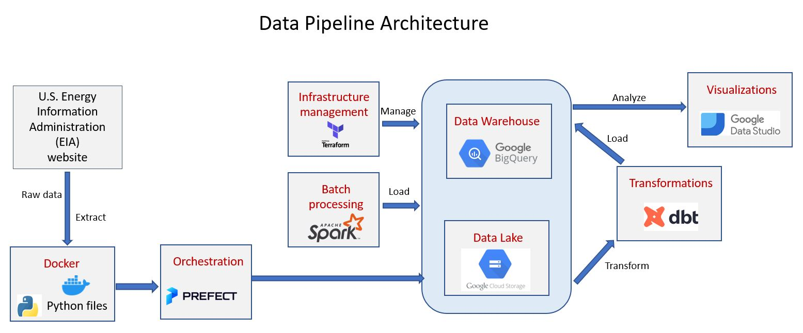

# Data Engineering Zoomcamp Final Project (2023)

## Overview
This data pipeline project intends to use the U.S. Energy Information Administration (EIA)'s weekly and monthly original estimates of state level coal production to generate more accurate estimates using quarterly mine level coal production data from the Mine Safety and Health Administration (MSHA). The estimates are guaranteed to conform with the MSHA survey data and include refuse coal. The project will focus on using the weekly and monthly coal production datasets, which are publicly available in XLS format on the EIA website. The datasets are part of the Weekly Coal Production dataset, which contains information on world energy statistics and is comprised of 22 CSV files.

This data pipeline transforms raw data into data ready for analytics with the intention of keeping data flowing to provide insights that lead to informed decisions. The goal of this project is to apply everything I have learned in the Data Engineering Zoomcamp course and build an end-to-end data pipeline.

## Datasets
The dataset has 54 columns - of which 53 are values for each week of year represented as "week 01", "week 02" etc . The following columns will be used:

<div align="center">
  
| #  | Attribute             |                     Description                                      |
|:--:|:---------------------:|----------------------------------------------------------------------|
|  1 | **state**                | A US state that produces coal.                  |
|  2 | **week 1 - week 12**          | Week of the year | 
|  3 | **year**          | Captures the year when the coal production data estimate | 
  
</div>

Dataset Url: https://www.eia.gov/coal/production/weekly/includes/archive.php


## Problem statement
The goals of the project include:
* Collect coal production data from the Mine Safety and Health Administration (Extract)
* Process the data to generate derived quantities for further analysis (Transform).</li>
* Save the transformed data in Big Query (Load).</li>
* Orchestrate the pipeline using an orchestration tool.</li>
* Generate a report summarizing some of the findings.</li>

This project has the goal of answering the following questions:

1. What is the average yearly tonange of coal produced in US since 2001?
2. Whichis the highest coal producing state and region?

## Technologies used
* Google Cloud Platform (GCP): Cloud-based auto-scaling platform by Google
* Google Cloud Storage (GCS): Data Lake
* BigQuery: Data Warehouse
* Terraform: Infrastructure-as-Code (IaC)
* Docker: Containerization
* SQL: Data Analysis & Exploration
* Prefect (Cloud): Pipeline Orchestration
* DBT (Cloud): Data Transformation
* Spark: Distributed Processing 
* Pandas: Data Analysis & Exploration

## Data Pipeline Architecture
* The pipeline created for this project was for batch processing which runs periodically on a daily basis. The image below represents the architecture used in this project.


### How the data pipeline works

* Prefect dataflows:

    1. [ETL Web to GCS](./flows/etl_web_to_gcs.py): fetches xls files from the EIA website, extracts and transforms the data, and finally loads them into GCS bucket as csv files.

    2. [ETL GCS to BigQuery](./flows/etl_gcs_to_bq.py): fetches data from GCS, transforms the data by adding a **year** column, and loads the data into BigQuery (Load) on the tables **eia_week** and **eia_month**.

* Dbt models:

    1. [stg_eiadata](./tranformers/models/staging/stg_eiadata.sql): selects a subset of columns from the raw table that was loaded into BigQuery, filtering only records that happened after January 1st, 2013.

    2. [production_states](./tranformers/models/core/production_states.sql): selects all data from stg_eiadata, partitions it by year and clusters the records by borough and contributing_factor_vehicle_1. Here, the partitioning makes it more efficient to query data and extract statistics by year. With respect to clustering, borough and contributing_factor_vehicle_1 are the main categorical values whose distributions I was interested in seeing when building my dashboard.

## Partitioning and Clustering:

- Partitioning was by column **year** to make it easier to manage and query the data. By dividing the table into smaller partitions, we can improve query performance and control costs by reducing the number of bytes read by a query.
- Clustering was not employed on this table since we have very few states and hence no query performance advantage. If we had numerous states then the table would be clustered by the column **state** to group data that have the same state value.


## Dashboard

The final product for this pipeline was a dashboard built on Google Data Studio. The dashboard contains a graph that shows the distribution of some categorical data and the distribution of the data across a temporal line.

## Peer review
* The project involved peer review of three projects by evauationg against a set evaluation criteria.

## Steps for Project Reproduction
Clone this repo.

For reproducibility, have Docker, Python (at least 3.9), git and Terraform installed.

Other tools and accounts required include a Google Cloud account, Prefect Cloud free account, and DBT developer account.


### Step 1
Go to your [Google Cloud Platform (GCP)](https://cloud.google.com/) account.

### Step 2: Setup of a GCP Project
- Create a new GCP project. Take note of the Project ID. 
- Go to `IAM & Admin > Service accounts > Create service account`, provide a service account name and grant the roles `Viewer`, `BigQuery Admin`, `Storage Admin`, `Storage Object Admin`. 
- Download service account key locally, rename it to `google_credentials.json`. 
- Store it in your home folder for easier access. 
- Set and export the GOOGLE_APPLICATION_CREDENTIALS using `export GOOGLE_APPLICATION_CREDENTIALS=<path/to/your/service-account-authkeys>.json`
- Activate the service account using `gcloud auth activate-service-account --key-file $GOOGLE_APPLICATION_CREDENTIALS`
- Activate the following API's:
   * https://console.cloud.google.com/apis/library/iam.googleapis.com
   * https://console.cloud.google.com/apis/library/iamcredentials.googleapis.com

### Step 3: Creation of GCP Infrastructure using Terraform
- [Install Terraform](https://learn.hashicorp.com/tutorials/terraform/install-cli)
- Change default variables `project`, `region`, `BQ_DATASET` in `variables.tf` (the file contains descriptions explaining these variables)
- Run the following commands from terraform directory on bash:
```shell
# Initialize state file (.tfstate)
terraform init

# Check changes to new infra plan
terraform plan

# Create new infra
terraform apply
```
- Confirm in GCP console that the infrastructure was correctly created.

### Step 4: Creation of Conda environment and Orchestration using prefect flows.

#### Execution

**1.** Create a Prefect Cloud accout and login. More information about Prefect Cloud is [here:] 
(https://docs.prefect.io/latest/cloud/cloud-quickstart/)

**2.** Register Prefect blocks and start Orion

**3.** Run the command "prefect cloud login" to login into Prefect cloud. 

**4.** From Prefect dashboard navigate to blocks menu --> add `GCS Bucket` and provide below inputs.
	* Block name : `<your-GCS-bucket-block-name>`
	* Bucket name: `<your-bucket-name-created-by-terraform>`
	* GCP credentials:  Click on Add --> It opens up create block of GCP credentials , provide input below.
		* Block name : `<your-GCP-credentials-block-name>`
		* Service Account info: copy paste the json file data in the service account info.
		* Click on create.
	* GCP credentials:  Click on Add --> Select the above created `<your-GCP-credentials-block-name>`
	* Code generated needs to be replaced in the `web-to-gcs-parent.py` and `gcs_to_bq_parent`python files.
		```
		from prefect_gcp.cloud_storage import GcsBucket
		gcp_cloud_storage_bucket_block = GcsBucket.load("<your-gcp-bucket-block-name")

		from prefect_gcp import GcpCredentials
		gcp_credentials_block = GcpCredentials.load("<your-gcs-cred-block-name>")

		```    
**5.** Run deployments from prefect dashboard

### Step 5: Transformations using dbt.

* Navigate to [dbt cloud](https://www.getdbt.com/) and create a new project by referring to this repository. Under the project subfolder update `/dbt`
* Select the BigQuery connection and update `service-account.json` file for the authentication. 
* Under dbt development menu, edit the `dbt-project.yml` to update the `name` and `models`.
* add [macros/extract_month_with_name.sql](https://github.com/shivanipadal/DE_projects/tree/main/Project2/dbt/macros),   [models/core/schema.yml](https://github.com/shivanipadal/Fire_Incident_DE/blob/main/dbt/models/core/schema.yml), [models/core/stg_fire_accident.sql](https://github.com/shivanipadal/Fire_Incident_DE/blob/main/dbt/models/core/stg_fire_accident.sql), [packages.yml](https://github.com/shivanipadal/Fire_Incident_DE/blob/main/dbt/packages.yml)
* Run below commands to execute the transformations:
	```
	dbt deps
	dbt build
	``` 
* The above will create dbt models and final tables
   **Note**: The transformations made were the selection of certain columns and creation of new ones (time differences, Month, Year). It is known that tables with less than 1 GB don't show significant improvement with partitioning and clustering; doing so in a small table could even lead to increased cost due to the additional metadata reads and maintenance needed for these features (or) the processing data clustered and with out clustered is same for small data

As of 20-Mar-2023, the dataset has a size of ~ 260 MB, thus I only performed transformations such as adding new variables, and not partitioning and clustering.

## Dashboard

Analytics was done using looker studios which pulls data from Big Querys. Link to the dashboard: 

A preview of the dashboard can also be seen below:

## Good to have in the future

    Data freshness would be a consideration in the production environment with data coming in daily.
    Prefect and dbt job scheduling would also be a consideration in production.

